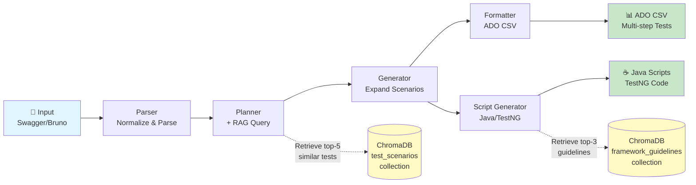
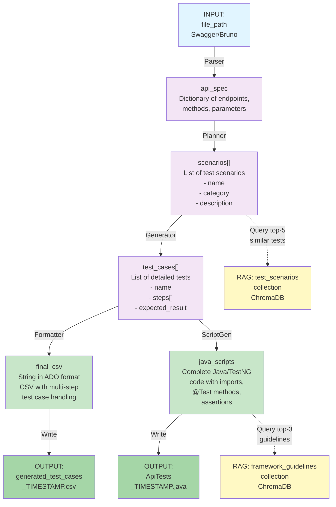

# Test-Authoring-Platform: AI-Powered Test Case Generation

**Automatically generate comprehensive test suites from API specifications using AI + Retrieval-Augmented Generation (RAG).**

The Test-Authoring-Platform eliminates manual test authoring by leveraging GPT-4 and ChromaDB to automatically create both **Azure DevOps (ADO) CSV test cases** and **Java TestNG automation scripts** from Swagger/Bruno API specifications. Built with LangGraph state machine orchestration, the platform ensures test coverage includes positive flows, negative scenarios, edge cases, and prevents duplicate test generation through intelligent RAG retrieval.

---

## Table of Contents

1. [Quick Overview](#quick-overview)
2. [Key Features](#key-features)
3. [Benefits](#benefits)
4. [Technology Stack](#technology-stack)
5. [Architecture](#architecture)
   - [High-Level Flow](#high-level-flow)
   - [System Architecture Diagram](#system-architecture-diagram)
   - [State Machine Diagram](#state-machine-diagram)
6. [Detailed Component Architecture](#detailed-component-architecture)
   - [Parser Node](#parser-node)
   - [Planner Node](#planner-node)
   - [Generator Node](#generator-node)
   - [Formatter Node](#formatter-node)
   - [Script Generator Node](#script-generator-node)
7. [RAG System Deep Dive](#rag-system-deep-dive)
8. [Getting Started](#getting-started)
   - [Prerequisites](#prerequisites)
   - [Installation](#installation)
   - [Environment Setup](#environment-setup)
9. [Usage Guide](#usage-guide)
   - [Running RAG Ingestion](#running-rag-ingestion)
   - [Running the Agent](#running-the-agent)
   - [CLI Arguments](#cli-arguments)
10. [How It Works: Step-by-Step Execution](#how-it-works-step-by-step-execution)
11. [RAG System Details](#rag-system-details)
    - [What is RAG?](#what-is-rag)
    - [Why RAG in This Project?](#why-rag-in-this-project)
    - [Embeddings Strategy](#embeddings-strategy)
    - [ChromaDB Collections](#chromadb-collections)
    - [Retrieval Mechanism](#retrieval-mechanism)
    - [Ingestion Pipelines](#ingestion-pipelines)
    - [Sample Data](#sample-data)
12. [Configuration & Customization](#configuration--customization)
    - [Environment Variables](#environment-variables)
    - [Customization Options](#customization-options)
    - [Advanced Configuration](#advanced-configuration)
13. [Sample Outputs](#sample-outputs)
14. [Project Structure](#project-structure)
15. [Dependencies](#dependencies)
16. [Troubleshooting & FAQs](#troubleshooting--faqs)
17. [Workflow Summary](#workflow-summary)

---

## Quick Overview

### The Problem
Manual test authoring is **time-consuming, error-prone, and inconsistent**:
- Testers spend days writing test cases manually
- Tests often lack comprehensive scenario coverage
- Duplicate tests are frequently created without awareness
- Maintaining consistency across Java code and ADO test cases is tedious

### The Solution
The Test-Authoring-Platform **automatically generates production-ready test cases** in minutes:
- **AI-driven planning**: GPT-4 brainstorms comprehensive test scenarios (positive, negative, edge cases)
- **RAG-powered deduplication**: Vector database prevents duplicate test generation
- **Dual output**: Both ADO CSV (for tracking) and Java/TestNG code (for automation)
- **Production-ready**: Generated Java scripts include framework best practices and ExtentReports logging

### Key Results
✅ **80% faster** test case creation (days → minutes)  
✅ **100% coverage**: Systematic positive/negative/edge case generation  
✅ **Zero duplicates**: RAG ensures no redundant tests  
✅ **Framework-consistent**: Java code follows team standards automatically  

---

## Key Features

- **🤖 AI-Powered Test Generation**
  - Uses GPT-4 to intelligently brainstorm test scenarios covering positive, negative, and edge cases
  - Automatically expands scenarios into step-by-step executable test cases
  - Validates all LLM output via Pydantic JSON schema enforcement

- **🔍 RAG-Based Deduplication**
  - Queries ChromaDB vector database for semantically similar existing tests
  - Injects existing test context into LLM prompt
  - Generates ONLY new/missing test scenarios, preventing duplicates

- **📊 Dual Output Pipeline**
  - **Azure DevOps CSV**: Multi-step test case format, directly importable into ADO
  - **Java/TestNG Scripts**: Production-ready automation code with REST Assured and ExtentReports

- **📁 Multi-Format API Support**
  - **Swagger JSON/YAML**: Parses OpenAPI specifications directly
  - **Bruno Collections**: Detects and processes directory of `.bru` API request files
  - **Auto-detection**: Intelligently determines input format and parses accordingly

- **📚 Framework-Aware Code Generation**
  - Script Generator queries RAG for company/framework best practices
  - Generated Java code enforces consistent patterns across test suites
  - Integrates ExtentReports for professional test reporting

- **🏠 Local-First Architecture**
  - **ChromaDB**: Persistent vector database stored locally—no cloud dependency
  - **HuggingFace Embeddings**: All embedding computations run locally (384-dimensional, `all-MiniLM-L6-v2`)
  - **Only external API call**: LLM inference via MeshAPI (OpenAI-compatible)
  - **Reduced costs & latency**: Eliminates external embedding API calls

- **📝 Comprehensive Audit Logging**
  - Every workflow step logged with timestamps, function names, and line numbers
  - Debug logs include full LLM prompts and responses for transparency
  - Timestamped log files in `logs/` directory facilitate root-cause analysis

---

## Benefits

### Speed & Efficiency
- **Reduce test authoring time from days to minutes**: Eliminate manual test case writing
- **Batch processing**: Generate entire test suites in single run
- **Parallel execution**: Formatter and Script Generator run simultaneously for faster output

### Quality & Coverage
- **Comprehensive scenarios**: Systematic generation of positive, negative, and edge cases
- **Framework compliance**: Generated Java code follows company best practices automatically
- **Consistent patterns**: RAG ensures reuse of proven test patterns

### Cost & Maintainability
- **Cost-effective**: Only LLM API calls—embeddings run locally
- **Reduced maintenance**: Centralized framework guidelines updated once, applied everywhere
- **Auditability**: Full execution logs enable rapid debugging and refinement

### Scalability
- **Handle complex APIs**: Works with Swagger specs having dozens of endpoints
- **Production-ready**: Generated scripts integrate with existing CI/CD pipelines
- **Extensible**: Easy to add new output formats or customize node behaviors

---

## Technology Stack

| Component | Technology | Purpose | Why Chosen |
|-----------|-----------|---------|-----------|
| **Workflow Engine** | LangGraph | State machine orchestration | Deterministic, auditable execution; handles branching (Formatter + Script Generator) |
| **LLM Provider** | MeshAPI (OpenAI-compatible) | AI for test planning & generation | GPT-4 reasoning for complex test scenarios |
| **Vector Database** | ChromaDB | RAG storage & retrieval | Local persistence, no external API, semantic similarity search |
| **Embeddings** | HuggingFace (`all-MiniLM-L6-v2`) | Convert text to vectors | 384-dim embeddings, runs locally, excellent quality/performance |
| **Validation** | Pydantic v2 | JSON schema enforcement | Ensures LLM responses follow strict format |
| **YAML/JSON Parsing** | PyYAML + Python JSON | API spec parsing | Standard, reliable parsing for Swagger files |
| **API Request Parsing** | Bruno collection reader | Parse `.bru` request files | Handles human-written API test requests |
| **Logging** | Python `logging` | Audit trail | Built-in, comprehensive with timestamps and line numbers |
| **CLI** | Click/argparse | Command-line interface | Standard Python CLI handling |
| **Environment Mgmt** | python-dotenv | Load `.env` configuration | Standard practice for API keys |

---

## Architecture

### High-Level Flow

```
INPUT (Swagger/Bruno) 
    ↓
[Parser Node] → Normalize & validate API specification
    ↓
[Planner Node] → Query RAG for existing tests + AI generates new scenarios
    ↓
[Generator Node] → AI expands scenarios into detailed test steps
    ↓
    ├─→ [Formatter Node] → Convert to ADO CSV format
    │
    └─→ [Script Generator Node] → Generate Java/TestNG code with framework guidelines
    ↓
OUTPUT (CSV + Java Scripts)
```

### System Architecture Diagram



### State Machine Diagram

```mermaid
stateDiagram-v2
    [*] --> Parser
    Parser --> Planner: api_spec
    Planner --> Generator: scenarios[]
    Generator --> Fork{Parallel<br/>Execution}
    Fork --> Formatter: test_cases[]
    Fork --> ScriptGen: test_cases[]
    Formatter --> Merge{Merge<br/>Outputs}
    ScriptGen --> Merge
    Merge --> [*]
    
    note right of Parser
        Parses Swagger/Bruno
        → api_spec dict
    end note
    
    note right of Planner
        Queries RAG
        Generates scenarios
        → scenarios list
    end note
    
    note right of Generator
        Expands to test steps
        → test_cases list
    end note
    
    note right of Formatter
        Converts to CSV
        → final_csv string
    end note
    
    note right of ScriptGen
        Generates Java code
        → java_scripts string
    end note
```

### Data Flow Diagram



---

## Detailed Component Architecture

### Parser Node

**File**: [src/nodes/parser.py](src/nodes/parser.py)

**Input**: `file_path` (string)

**Output**: `api_spec` (dictionary)

**Purpose**: Validates and normalizes API specifications from multiple formats into a unified internal representation.

**How It Works**:
1. Detects input file type by extension (`.json`, `.yaml`, `.yml`) or directory (Bruno collection)
2. **For Swagger files**: Parses JSON/YAML directly into Python dictionary
3. **For Bruno collections**: 
   - Recursively scans directory for all `.bru` files
   - Parses each request file to extract HTTP method, endpoint, headers, body
   - Merges all requests into unified API spec
4. Validates spec structure with error handling
5. Stores normalized spec in state's `api_spec` field

**Error Handling**:
- Invalid file format → Logs error, raises exception
- Missing file → Caught and reported with helpful message
- Malformed JSON/YAML → JSONDecodeError/YAMLError caught and logged

**Example Output** (simplified):
```python
api_spec = {
  "endpoints": [
    {
      "path": "/users",
      "method": "GET",
      "parameters": [...],
      "response_schema": {...}
    },
    {
      "path": "/users",
      "method": "POST",
      "parameters": [...],
      "request_body_schema": {...}
    }
  ]
}
```

---

### Planner Node

**File**: [src/nodes/planner.py](src/nodes/planner.py)

**Input**: `api_spec` (from Parser)

**Output**: `scenarios` (list of test scenario objects)

**RAG Integration**: Queries ChromaDB `test_scenarios` collection for top-5 semantically similar existing tests

**Purpose**: Intelligently generates new test scenarios while avoiding duplicates by learning from existing tests.

**How It Works**:

1. **RAG Retrieval** (ChromaDB Query):
   - Serializes API spec to JSON string
   - Queries ChromaDB for top-5 documents with highest semantic similarity
   - Retrieved docs = existing test cases similar to this API
   - Extracts full text and metadata of retrieved documents

2. **LLM Prompt Construction**:
   - Builds detailed prompt including:
     - API specification details
     - **Retrieved existing scenarios**: *"Here are 5 existing test cases for similar APIs..."*
     - **Explicit instruction**: *"Generate ONLY NEW scenarios not covered by the existing tests above"*
     - Expected format: JSON array with structure `[{name, category, description}, ...]`

3. **LLM Call** (GPT-4 via MeshAPI):
   - Sends prompt to LLM
   - LLM generates test scenarios covering:
     - **Positive**: Happy-path scenarios (valid inputs, expected success)
     - **Negative**: Error scenarios (invalid inputs, HTTP errors, auth failures)
     - **Edge cases**: Boundary conditions (large payloads, empty responses, etc.)

4. **Output Parsing**:
   - Uses `PydanticOutputParser` with strict Pydantic model
   - Ensures response is valid JSON matching schema
   - If parsing fails, attempts recovery or raises error

5. **Stores in State**: `scenarios` = list of new scenario objects

**Example Output**:
```python
scenarios = [
  {
    "name": "Verify GET /users returns 200 status code and list of users",
    "category": "positive",
    "description": "Test retrieving all users with valid request"
  },
  {
    "name": "Verify GET /users with invalid filter parameter returns 400",
    "category": "negative",
    "description": "Test error handling for malformed query parameters"
  },
  ...
]
```

---

### Generator Node

**File**: [src/nodes/generator.py](src/nodes/generator.py)

**Input**: `api_spec` (from Parser) + `scenarios` (from Planner)

**Output**: `test_cases` (list of detailed test case objects with steps)

**Purpose**: Expands high-level test scenarios into detailed, step-by-step executable test cases.

**How It Works**:

1. **LLM Prompt Construction**:
   - Includes full API spec and all planned scenarios
   - Asks LLM: *"For each scenario, write detailed step-by-step test case instructions"*
   - Specifies expected format: JSON array with structure for each test case

2. **LLM Call** (GPT-4 via MeshAPI):
   - For each scenario, generates 5-10 detailed test steps
   - Steps include:
     - **Action**: What to do (e.g., "Send GET request")
     - **Parameters**: Request details (method, endpoint, payload)
     - **Expected Result**: What should happen (status code, response structure)

3. **Output Parsing**:
   - Uses `PydanticOutputParser` to enforce strict schema
   - Validates all test steps follow required structure

4. **Stores in State**: `test_cases` = list of expanded test case objects

**Example Output**:
```python
test_cases = [
  {
    "name": "Verify GET /users returns 200 status code",
    "scenario_type": "positive",
    "description": "Test retrieving all users",
    "steps": [
      {
        "step_number": 1,
        "action": "Prepare GET request",
        "parameters": {"endpoint": "/users", "headers": {"Accept": "application/json"}},
        "expected_result": "Request prepared successfully"
      },
      ...
    ]
  },
  ...
]
```

---

### Formatter Node

**File**: [src/nodes/formatter.py](src/nodes/formatter.py)

**Input**: `test_cases` (from Generator)

**Output**: `final_csv` (string in ADO CSV format)

**Purpose**: Converts structured test cases into Azure DevOps (ADO) CSV format with proper multi-step test case handling.

**How It Works**:

1. **CSV Structure**:
   - Columns: `ID, Work Item Type, Title, Test Step, Step Expected, Tags`
   - ADO-specific requirement: Multi-step tests have:
     - **First step row**: Title field populated, step description in "Test Step"
     - **Subsequent step rows**: Title field is BLANK, step description in "Test Step"

2. **Conversion Logic**:
   - For each test case:
     - First step: Write title in "Title" column, step in "Test Step"
     - Remaining steps: Leave "Title" BLANK, step in "Test Step"
   - Set Work Item Type to "Test Case"
   - Generate ID sequentially or use provided ID
   - Populate "Step Expected" with expected result

3. **Stores in State**: `final_csv` = complete CSV string

**Example Output** (CSV snippet):
```csv
ID,Work Item Type,Title,Test Step,Step Expected,Tags
1,Test Case,Verify GET /users returns 200 status code and list of users,Prepare GET request for /users endpoint with Accept: application/json,Request prepared successfully,positive
2,Test Case,,Send the request,Request is sent to the server,
3,Test Case,,Verify the response status code is 200,Status code is 200,
4,Test Case,,Verify the response contains a list of users,Response body contains array of user objects,
```

---

### Script Generator Node

**File**: [src/nodes/script_generator.py](src/nodes/script_generator.py)

**Input**: `api_spec` + `test_cases` (runs in parallel with Formatter)

**RAG Integration**: Queries ChromaDB `framework_guidelines` collection for top-3 Java/TestNG best practices

**Output**: `java_scripts` (complete Java/TestNG code)

**Purpose**: Generates production-ready Java automation scripts that follow company framework standards.

**How It Works**:

1. **RAG Retrieval** (Framework Guidelines):
   - Queries ChromaDB `framework_guidelines` collection
   - Retrieves top-3 documents (e.g., TestNG patterns, REST Assured examples, ExtentReports usage)
   - Context = company-specific testing best practices

2. **LLM Prompt Construction**:
   - Includes API specification, test cases, and framework guidelines
   - Asks LLM: *"Generate Java TestNG test class following the guidelines below"*
   - Specifies format: Clean Java code (no markdown wrapping)

3. **LLM Call** (GPT-4 via MeshAPI):
   - Generates complete TestNG class with:
     - All required imports (JUnit, TestNG, REST Assured, ExtentReports)
     - `@Test` methods (one per test case)
     - Proper exception handling and logging

4. **Post-Processing**:
   - If LLM wraps code in ````java` ``` blocks, extracts just the code
   - Cleans up markdown artifacts
   - Validates basic Java syntax (optional)

5. **Stores in State**: `java_scripts` = complete Java code string

---

## RAG System Deep Dive

### What is RAG?

**Retrieval-Augmented Generation (RAG)** combines information retrieval with language model generation to avoid hallucination and inject domain-specific knowledge.

**Key concept**: Rather than asking LLM to generate from scratch, retrieve relevant knowledge first, then generate informed by that knowledge.

### Why RAG in This Project?

**Without RAG**: Agent generates same tests repeatedly (duplicates)

**With RAG**: Agent queries existing tests, generates only new complementary tests (no duplicates)

### Embeddings Strategy

**Why Local Embeddings?**
- **Cost**: $0 (open-source) vs OpenAI ($0.10 per 1M tokens)
- **Latency**: 50-100ms (local) vs 500ms+ (API)
- **Privacy**: On-device only
- **Model**: HuggingFace `all-MiniLM-L6-v2` - 384-dimensional, trained on 1B sentence pairs

### ChromaDB Collections

**Collection 1: `test_scenarios`**
- Stores existing test cases (from `sample_test_cases.csv`)
- Used by Planner to prevent duplicates
- ~14 seed documents

**Collection 2: `framework_guidelines`**
- Stores Java/TestNG best practices (from `framework_guidelines.md`)
- Used by Script Generator to ensure code consistency
- ~25 guideline chunks

### Retrieval Mechanism

**Planner Retrieval**:
```python
# Query: API specification as JSON
# Result: Top-5 most similar existing tests
# Use: Inject into prompt "Generate ONLY new tests not in this list"
```

**Script Generator Retrieval**:
```python
# Query: Test case details
# Result: Top-3 most relevant framework guidelines
# Use: Inject into prompt "Follow these patterns when generating Java code"
```

### Ingestion Pipelines

**RAG Ingestion** (`scripts/rag_ingestion.py`):
- Reads `data/rag_samples/sample_test_cases.csv`
- Consolidates multi-row test cases into single documents
- Creates embeddings and stores in ChromaDB

**Framework Ingestion** (`scripts/framework_ingestion.py`):
- Reads `data/rag_samples/framework_guidelines.md`
- Splits into 500-char chunks
- Creates embeddings and stores in ChromaDB

### Sample Data

**Sample Test Cases**: 14 multi-step tests for User API endpoints

**Framework Guidelines**: ~2000 chars of Java/TestNG best practices

---

## Getting Started

### Prerequisites

- **Python 3.8 or higher**
- **pip** (Python package manager)
- **Git** (for cloning repository)
- **MeshAPI API Key** (for LLM access)

### Installation

**Step 1: Clone Repository**
```powershell
git clone <repository-url>
cd Test-Authoring-Platform-030526
```

**Step 2: Create Virtual Environment**

```powershell
python -m venv .venv
.\.venv\Scripts\Activate.ps1
```

**Step 3: Install Dependencies**

```powershell
pip install -r requirements.txt
```

### Environment Setup

**Step 1: Create `.env` File**

```powershell
New-Item -Path .env -Type File
```

**Step 2: Add API Key**

Edit `.env` and add:
```env
MESHAPI_API_KEY=your_actual_key_here
```

**Step 3: Verify Setup**

```powershell
python -c "import langchain; import chromadb; print('✅ All imports successful!')"
```

---

## Usage Guide

### Running RAG Ingestion

Before first run, seed the vector database:

```powershell
python scripts/rag_ingestion.py
python scripts/framework_ingestion.py
```

### Running the Agent

**Basic usage**:
```powershell
python main.py --input data/inputs/sample_swagger.json
```

**With custom output**:
```powershell
python main.py --input data/inputs/sample_swagger.json --output data/outputs/my_tests.csv
```

**Using Bruno collection**:
```powershell
python main.py --input data/inputs/products_bruno/
```

### CLI Arguments

| Argument | Required | Type | Description |
|----------|----------|------|-------------|
| `--input` | ✅ Yes | string | Path to API spec file or Bruno directory |
| `--output` | ❌ Optional | string | Output file path (defaults to timestamped filename) |

---

## How It Works: Step-by-Step Execution

### Phase 1: Parser Node
- Validates and normalizes API specification
- Detects format (Swagger JSON/YAML or Bruno collection)
- Stores normalized spec in state

### Phase 2: Planner Node
- Queries ChromaDB for top-5 semantically similar existing tests
- Injects retrieved tests into LLM prompt
- LLM generates ONLY new test scenarios (positive, negative, edge cases)
- Stores scenarios in state

### Phase 3: Generator Node
- Expands planned scenarios into detailed test steps
- LLM writes step-by-step instructions for each scenario
- Stores detailed test cases in state

### Phase 4A: Formatter Node (Parallel)
- Converts test cases to ADO CSV format
- Handles multi-step test case structure correctly
- Writes CSV file to `data/outputs/`

### Phase 4B: Script Generator Node (Parallel)
- Queries ChromaDB for top-3 framework guidelines
- LLM generates Java/TestNG code following guidelines
- Writes Java file to `data/outputs/`

### Phase 5: Output
- Log file automatically created in `logs/`
- Summary printed to console

**Total execution time**: 12-17 seconds

---

## RAG System Details

### What is RAG?

Retrieval-Augmented Generation combines:
1. **Retrieval**: Search knowledge base (ChromaDB) for relevant documents
2. **Generation**: Pass retrieved context to LLM along with query
3. **Result**: LLM generates informed by actual knowledge, not hallucination

### Why RAG in This Project?

| Problem | Solution |
|---------|----------|
| Duplicate test generation | RAG retrieves existing tests before generating |
| Inconsistent code patterns | RAG retrieves framework guidelines before generating |
| Manual deduplication | Automated via semantic similarity search |

### Embeddings Strategy

- **Model**: HuggingFace `all-MiniLM-L6-v2`
- **Dimensions**: 384
- **Training**: 1B sentence pairs
- **Why local**: Cost-effective, fast, private

### ChromaDB Collections

```
ChromaDB
├── test_scenarios (14 documents)
│   └── Existing test cases from sample_test_cases.csv
└── framework_guidelines (25 chunks)
    └── Java/TestNG best practices from framework_guidelines.md
```

### Retrieval Mechanism

**Planner**: Query with API spec → Retrieve top-5 existing tests → Inject into prompt

**Script Generator**: Query with test details → Retrieve top-3 guidelines → Inject into prompt

### Ingestion Pipelines

**RAG Ingestion**: `scripts/rag_ingestion.py`
- Load CSV → Parse multi-step tests → Create embeddings → Store in ChromaDB

**Framework Ingestion**: `scripts/framework_ingestion.py`
- Load markdown → Split into chunks → Create embeddings → Store in ChromaDB

### Sample Data

- **Sample Tests**: 14 multi-step test cases for `/users` endpoints
- **Guidelines**: Java/TestNG best practices markdown file

---

## Configuration & Customization

### Environment Variables

```env
MESHAPI_API_KEY=your_actual_api_key_here
```

### Customization Options

**Change LLM Model** (edit `src/utils/llm.py`):
```python
model="gpt-3.5-turbo"  # Faster, cheaper
model="gpt-4"          # Default, more powerful
```

**Adjust RAG Retrieval Count** (edit `src/nodes/planner.py`):
```python
k=5   # Default (balanced)
k=10  # More comprehensive
k=3   # Faster execution
```

**Modify Node Prompts**:
- Edit `src/nodes/planner.py` for scenario generation
- Edit `src/nodes/generator.py` for step expansion
- Edit `src/nodes/script_generator.py` for Java code generation

### Advanced Configuration

- **ChromaDB location**: Edit `src/utils/rag.py`
- **Embedding model**: Edit `src/utils/rag.py`
- **Text splitting**: Edit `scripts/framework_ingestion.py`

---

## Sample Outputs

### CSV Output

File: `data/outputs/generated_test_cases_20260503_150447.csv`

Multi-step test cases in ADO format with proper blank titles for continuation rows.

### Java Script Output

File: `data/outputs/ApiTests_20260503_150447.java`

Production-ready TestNG class with REST Assured patterns, assertions, and ExtentReports logging.

---

## Project Structure

```
Test-Authoring-Platform-030526/
├── README.md                        # This file
├── main.py                          # CLI entry point
├── requirements.txt                 # Python dependencies
├── .env.example                     # Example environment config
├── chroma_db/                       # ChromaDB vector database
├── logs/                            # Execution logs
├── data/
│   ├── inputs/                      # Input API specs (Swagger/Bruno)
│   ├── outputs/                     # Generated test artifacts
│   └── rag_samples/                 # RAG seed data
├── scripts/
│   ├── rag_ingestion.py            # Populate test_scenarios collection
│   └── framework_ingestion.py       # Populate framework_guidelines collection
└── src/
    ├── agent.py                     # LangGraph state machine
    ├── models/
    │   └── state.py                # State object definition
    ├── nodes/
    │   ├── parser.py               # Parse API spec
    │   ├── planner.py              # Plan scenarios (with RAG)
    │   ├── generator.py            # Generate test cases
    │   ├── formatter.py            # Format to CSV
    │   └── script_generator.py     # Generate Java code (with RAG)
    └── utils/
        ├── llm.py                   # LLM client
        ├── rag.py                   # ChromaDB integration
        ├── logger.py                # Logging setup
        └── file_io.py               # File utilities
```

---

## Dependencies

| Library | Purpose |
|---------|---------|
| **langchain** | LLM orchestration framework |
| **langgraph** | State machine workflow engine |
| **langchain-openai** | OpenAI/MeshAPI integration |
| **pydantic** | Data validation & JSON schema |
| **pyyaml** | YAML/JSON parsing |
| **python-dotenv** | Environment variable loading |
| **chromadb** | Vector database (local) |
| **sentence-transformers** | HuggingFace embeddings |

Install all with:
```powershell
pip install -r requirements.txt
```

---

## Troubleshooting & FAQs

### Common Issues

**Missing `.env` file**
```
Solution: Create .env and add MESHAPI_API_KEY
```

**ChromaDB collections empty**
```
Solution: Run rag_ingestion.py and framework_ingestion.py
```

**Invalid Swagger format**
```
Solution: Validate with https://editor.swagger.io/
```

**LLM response parsing fails**
```
Solution: Check logs for LLM response format issues
```

### Reading Logs

Log file location: `logs/run_YYYYMMDD_HHMMSS.log`

```powershell
Get-Content logs/run_*.log -Tail 50
```

### FAQs

**Q: How do I handle duplicate test generation?**
A: RAG automatically prevents duplicates by retrieving existing tests before generation.

**Q: Can I customize generated CSV columns?**
A: Yes, edit `src/nodes/formatter.py`.

**Q: Is generated Java code production-ready?**
A: Yes, it includes TestNG, REST Assured, and ExtentReports. Review and customize for your CI/CD.

**Q: How do I run this offline?**
A: Everything runs locally except LLM calls—you need MeshAPI for GPT-4.

---

## Workflow Summary

```
INPUT (Swagger/Bruno)
  ↓
[1. PARSER] → Normalize & validate
  ↓
[2. PLANNER] + RAG → Generate scenarios (no duplicates)
  ↓
[3. GENERATOR] → Expand to test steps
  ↓
[4A. FORMATTER] + [4B. SCRIPT GENERATOR] → Parallel execution
  ↓
OUTPUT (CSV + Java + Log)
```

**Execution time**: 12-17 seconds per run

**Key features**: AI-powered generation, RAG deduplication, dual output, production-ready code

---

**For more details, see the extended sections above or check execution logs in the `logs/` directory.**
